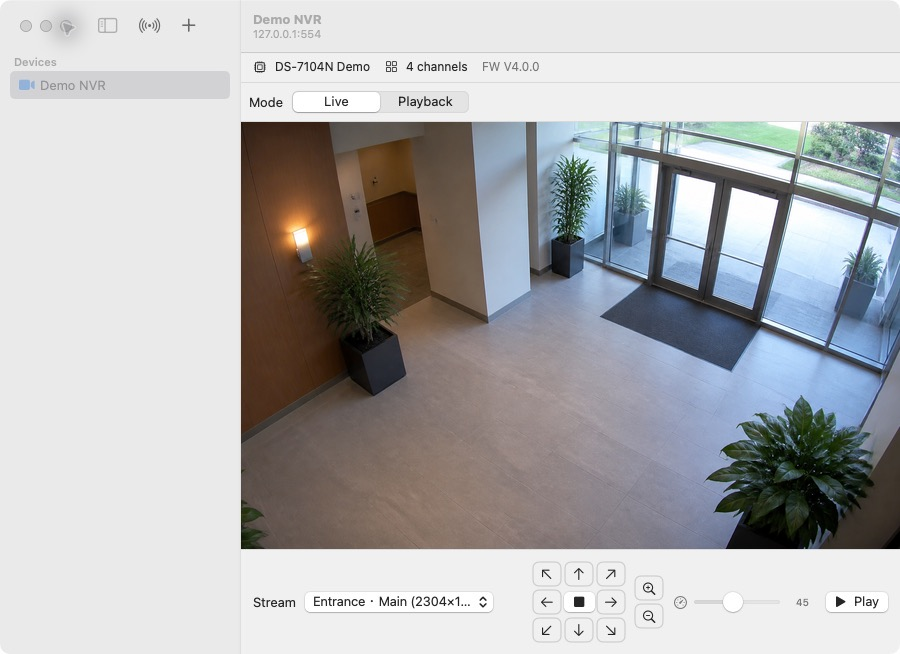
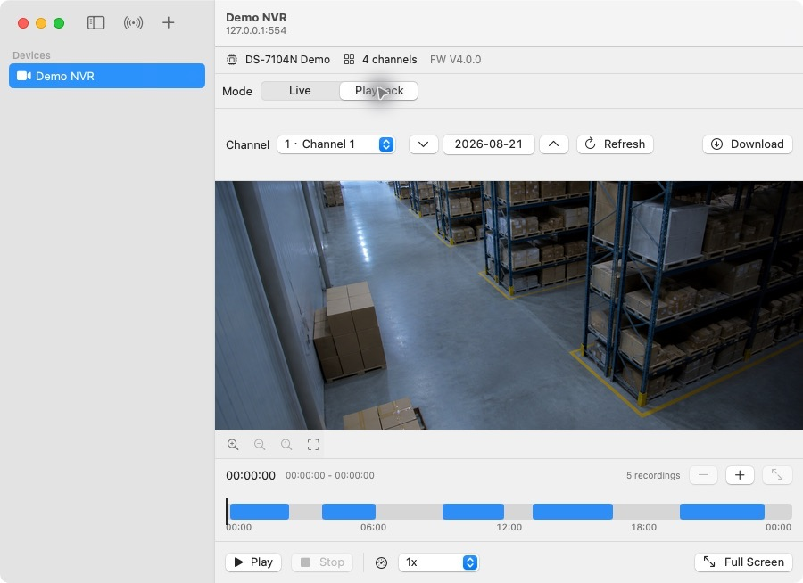

# Hikvision iVMS for macOS

一个超轻量的原生 macOS 海康摄像头/NVR 客户端。Release app 约 **2 MB**，
ad-hoc 签名，只使用 Apple 系统框架构建，适合想要一个简洁本地客户端的场景。

[English README](README.md)

<table>
  <tr>
    <td></td>
    <td></td>
  </tr>
  <tr>
    <td align="center">实时预览、码流选择和 PTZ 控制</td>
    <td align="center">按天回放、时间轴缩放、倍速和录像下载</td>
  </tr>
</table>

## 功能

- 海康摄像头和 NVR 通道实时预览。
- 按天回放，界面接近消费级摄像头的录像时间轴。
- 蓝色时间段表示有录像覆盖，灰色表示无录像。
- 时间轴缩放、全屏回放和画面放大工具。
- 通过 RTSP `Scale` 控制回放倍速。
- 录像搜索，并将录像文件直接流式下载到磁盘。
- PTZ 支持点按步进和长按连续移动。
- 设备暴露 PCMU/PCMA 音轨时支持 G.711 音频播放。
- 通过 SADP 组播发现设备。
- 密码保存在 macOS Keychain。

## 设计目标

- **极轻量：** Release app 约 2 MB。
- **原生：** 使用 SwiftUI、Network.framework、VideoToolbox、AVFoundation、
  AudioToolbox/AVAudioEngine 等系统能力。
- **小体积分发：** 保持安装包简单，依赖系统自带的媒体和网络能力。
- **直接协议：** RTSP over TCP interleaved RTP + 海康 ISAPI。

## 兼容性

项目目标系统为 macOS 14 或更新版本，重点支持海康 RTSP/ISAPI 设备。目前支持
H.264/H.265 视频和 G.711 PCMU/PCMA 音频。

海康回放 URL 使用设备本地时间习惯。部分设备会把 `yyyyMMddtHHmmssz` 末尾的
`z` 当成本地时间标记，而不是 UTC。

## 构建

用 Xcode 打开：

```sh
open MyIVMS.xcodeproj
```

终端构建：

```sh
xcodebuild \
  -project MyIVMS.xcodeproj \
  -scheme MyIVMS \
  -configuration Release \
  -destination 'platform=macOS' \
  -derivedDataPath build/DerivedData \
  build
```

打包 zip：

```sh
ditto -c -k --sequesterRsrc --keepParent \
  build/DerivedData/Build/Products/Release/MyIVMS.app \
  MyIVMS.app.zip
```

GitHub Actions 会把 zip 作为 workflow artifact 上传。推送 `v0.1.0` 这类版本
标签时，会自动创建 GitHub Release 并附上同一个 zip。

项目使用 Xcode file-system-synchronized groups，因此 `MyIVMS/` 下的源文件会由
project 自动纳入。

## 打开 App

GitHub Actions 产物使用 ad-hoc 签名，没有 notarize。

首次启动：

1. 右键点击 `MyIVMS.app`。
2. 选择 **打开**。
3. 在 macOS 警告弹窗里再次点击 **打开**。

如果仍然被 macOS 阻止：

1. 打开 **系统设置**。
2. 进入 **隐私与安全性**。
3. 找到关于 `MyIVMS` 的安全提示。
4. 点击 **仍要打开**。

macOS 也可能请求 **本地网络** 权限。需要 SADP 设备发现时请允许。

## 目录结构

```text
MyIVMS/
  Discovery/   SADP 组播发现
  ISAPI/       海康 ISAPI 搜索和下载
  Models/      设备与应用状态
  PTZ/         PTZ 命令模型
  RTSP/        RTSP、SDP、Digest auth、RTP、音频和视频解码
  Security/    Keychain 密码存储
  Video/       流会话和 URL helper
  Views/       SwiftUI 界面
```

## 安全说明

- 密码保存在 macOS Keychain。
- 录像下载直接流式写入磁盘，适合处理较大的录像文件。
- 设备连接和录像回放都在本机直接完成，配置保存在本地。

## 限制

- 暂不支持双向语音。
- 回放倍速取决于 NVR 是否接受 RTSP `Scale`。
- 尚未接入原生 AAC 音频；当前支持 G.711 PCMU/PCMA。
- 不在本地组播域内的设备可能无法通过 SADP 发现。

## 许可证

MIT
